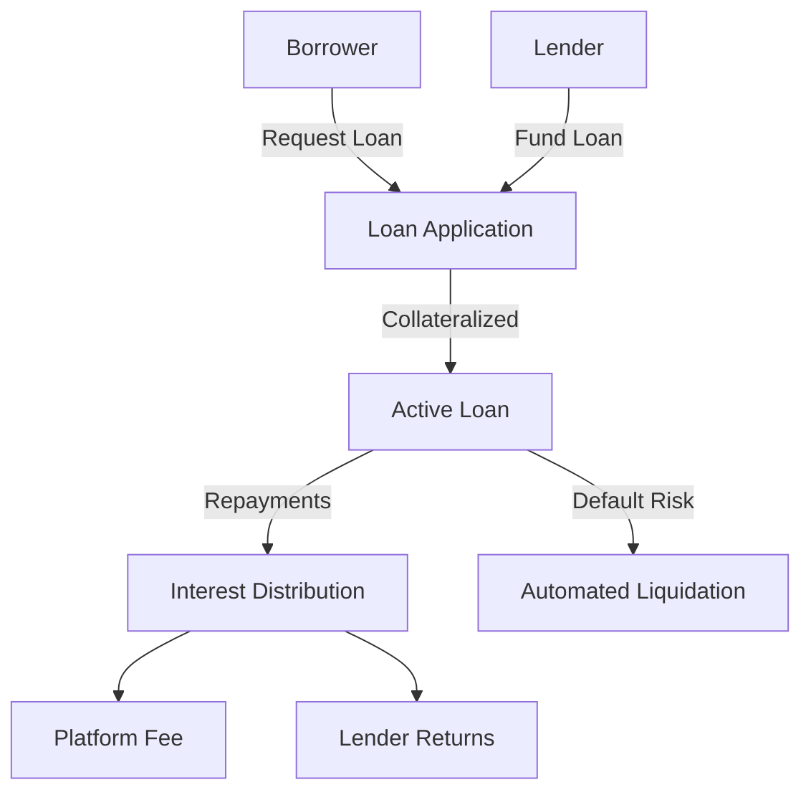

# Trace Lending

A decentralized lending platform built on Stacks that provides secure, transparent, and efficient lending services with innovative reputation and risk management. By leveraging blockchain technology, Trace Lending eliminates traditional banking intermediaries and creates a fair, accessible lending ecosystem.

## Overview

Trace Lending enables:
- Borrowers to secure loans with flexible terms
- Lenders to earn interest on their digital assets
- Transparent, smart contract-based loan management
- Advanced risk assessment through on-chain reputation scoring
- Low platform fees and automated liquidation mechanisms

## Architecture



The system uses multiple data maps to track:
- Loan listings and their current status
- User lending and borrowing profiles
- Repayment schedules
- Collateral and liquidation thresholds
- User credit scores

## Contract Documentation

### Main Contract: trace-lending

Core functionalities:

1. **Loan Management**
   - Create loan listings
   - Fund loans with collateral
   - Track loan status and repayments
   - Manage loan lifecycles

2. **Risk Management**
   - Collateral requirements
   - Automated liquidation
   - Credit score tracking
   - Dynamic interest rates

3. **Financial Mechanisms**
   - Secure fund transfers
   - Platform fee collection
   - Interest distribution
   - Reputation-based lending

## Getting Started

### Prerequisites
- Clarinet installation
- Stacks wallet
- STX tokens for transactions

### Basic Usage

**1. Creating a Loan**
```clarity
(contract-call? .trace-lending create-loan 
    u1000     ;; total loan amount
    u50       ;; interest rate (5%)
    u50000    ;; loan term (blocks)
    u2500     ;; collateral amount
    u500      ;; liquidation threshold
)
```

**2. Funding a Loan**
```clarity
(contract-call? .trace-lending fund-loan 
    u1 ;; loan-id
)
```

**3. Repaying a Loan**
```clarity
(contract-call? .trace-lending repay-loan 
    u1        ;; loan-id
    u1100     ;; repayment amount (principal + interest)
)
```

## Function Reference

### Borrower Functions
- `create-loan`: Initialize a new loan
- `repay-loan`: Make loan repayments
- `liquidate-loan`: Trigger loan liquidation

### Lender Functions
- `fund-loan`: Provide funds for a loan
- `get-loan-details`: Retrieve loan information

### Read-only Functions
- `get-user-profile`: Retrieve user lending profile
- `get-loan-details`: Get specific loan details

## Development

### Testing
Run tests using Clarinet:
```bash
clarinet test
```

### Security Considerations

1. **Fund Protection**
   - Mandatory collateralization
   - Automated liquidation mechanisms
   - Smart contract-enforced transfers

2. **Risk Mitigation**
   - Collateral threshold tracking
   - Reputation-based credit scoring
   - Platform fee collection

3. **System Integrity**
   - Transparent loan lifecycle
   - Immutable transaction records
   - Role-based access controls

### Important Limitations
- Loans are denominated in STX
- Platform fee is fixed at 2.5%
- Liquidation is algorithmically determined
- All transactions are block-height dependent